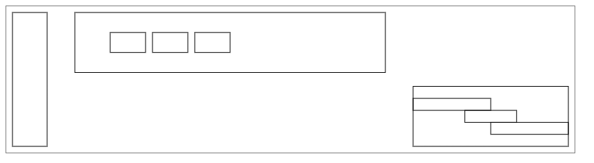
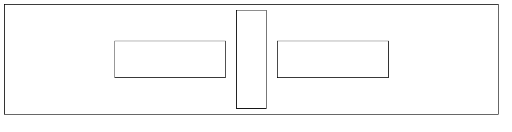

# Subform Layout



[Edit this layout on Codepen](https://codepen.io/lynaghk/pen/Jpevwj)

[Subform](https://subformapp.com) is a visual tool for defining and exploring responsive designs.
This is an embeddable version of its layout engine, which you might want to use if:

+ You want identical layouts across multiple platforms (Web, iOS, Android, etc.)
+ You need layout on a platform without any native facilities (e.g., OpenGL)
+ You're just tired of CSS

The demos and engine in this repo are free to use and modify for non-commercial use only.
For commercial licensing and support, please [contact us](mailto:subform@generalreactives.com).

This repo contains a Web Assembly version of the Subform engine.
The core engine knows nothing about the DOM, JavaScript, etc.
Its internal API is a byte array, and the engine can be run incrementally, "off the main thread", and does not require a garbage collector.

If you'd like to use API directly, or try the engine on a different platform (iOS, Android, C, etc.), please [contact us](mailto:subform@generalreactives.com).


## Plain JS Example

The [render_to_canvas.js](examples/render_to_canvas.js) creates the layout seen above, which is defined via a tree of plain JavaScript objects:

```javascript
{layout: {mode: "self-directed",
          horizontal: {size: width},
          vertical: {size: height}},

          childrenLayout: {mode: "grid",
                           rows: {beforeFirst: 10, between: 20, afterLast: 10},
                           cols: {beforeFirst: 10, between: 40, afterLast: 10, sizes: [50, "2s", "1s"]}},

          children: [{layout: {rowSpan: 2}},

                     {layout: {rowIdx: 0, colIdx: 1},
                      childrenLayout: {mode: "stack-horizontal",
                                       mainBeforeFirst: "1s",
                                       mainBetween: 10,
                                       mainAfterLast: "50%"},
                      children: [{}, {}, {}]},

                     {layout: {rowIdx: 1, colIdx: 2},
                      children: [{layout: {cross: {before: 0}}},
                                 {},
                                 {layout: {cross: {after: 0}}}]}]}
```

## React.js demo

In the [React.js example](examples/render_to_react.js), nodes have `layout` and `childrenLayout` props:

```javascript
var app = function(width, height){
  return React.createElement("div", {layout: {mode: "self-directed",
                                              horizontal: {size: width},
                                              vertical: {size: height}},
                                     childrenLayout: {mode: "stack-horizontal"}},

                             React.createElement("div"),
                             React.createElement("div", {layout: {main: {before: 20, size: 50, after: 20},
                                                                  cross: {before: 10, size: "1s", after: 10}}}),
                             React.createElement("div"));
};

subform_init_react_layout(function(render){
  render(app(400, 400), document.getElementById("container"));
});

```



The provided `render` function takes a React component, walks it to extract these layout props, solves the layout, and then adds the CSS absolute positioning inline styles before calling `ReactDOM.render` to actually mount/update.

The developer experience is exactly the same as using inline CSS.
(Except that, hopefully, layouts can be implemented without referring to css-tricks.com =P)


## Layout semantics

Subform's layout semantics are similar to flexbox, but with fewer concepts, applied uniformly.
See [this article](https://subformapp.com/articles/why-not-flexbox/) for an overview, or [this talk](https://www.deconstructconf.com/2017/kevin-lynagh-choosing-features) for the original motivation and conceptual design process.

Here's the tl;dr:

+ All elements have a horizontal and vertical axis, each of which consists of space before, size, and space after.

+ Elements either control their own position ("self-directed", akin to CSS absolute positioning) or are positioned by their parent ("parent-directed").

+ Parents can position their parent-directed children in a vertical stack, horizontal stack, or grid.

+ The same units -- pixels, percentages (of the parent size), and stretch (akin to flex, proportionally dividing up available space) -- are used everywhere, with minimum and maximum constraints as part of the unit.

All fields are optional.


## Reasons to consider Subform layout

+ You'd like to use [a visual tool](https://subformapp.com) to explore and refine layout.

+ You'd like to use the same layout engine on multiple platforms.

+ You need more than simple pinning constraints, but don't want the complexity of CSS.


## Why Subform layout might be a bad fit

+ You don't want to ship a layout engine with your application.

+ You have a workflow built around AutoLayout/Cassowary, CSS, or Photoshop comps that's working just fine.


## Notes / Caveats

+ The `subform_layout.js` file is ~400kB because it contains the engine WASM encoded as base64 to workaround CORS limitations, in addition to various shims required for the demos.
In a production toolchain, the engine can be substantially smaller.

+ The API shown in these examples is subject to change.
In fact, I'd love to hear your ideas about that!
I'm open to implementing both a more programmatic API (using data structures instead of strings like "1s") as well as a full on human-shorthand stringified version (defined via EBNF grammar, of course).


## Alternatives

Projects in a similar space:

+ Facebook's [Yoga](https://github.com/facebook/yoga) is a "cross-platform layout engine which implements Flexbox".

+ @randrew's [Layout](https://github.com/randrew/layout) is a "single-file library for calculating 2D UI layouts using stacking boxes".

+ @schibsted's [Layout](https://github.com/schibsted/layout) is a "framework for implementing iOS user interfaces using runtime-evaluated expressions for layout and XML template files. It is intended as a more-or-less drop-in replacement for Nibs and Storyboards, but offers a number of advantages".
